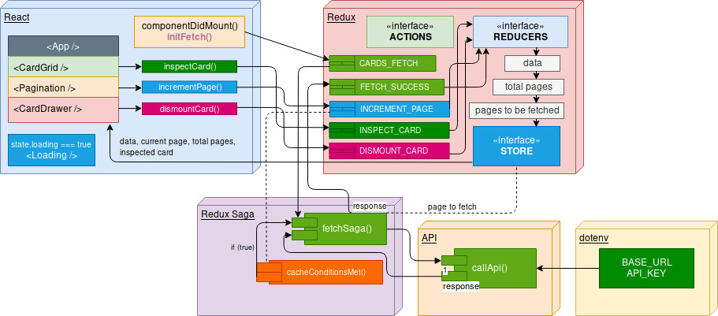

# Front-End Test: Pagination Cache

### Description:

This app was developed as a technical assignment for Accenture.
It aims to make asynchronous to an API that holds IT support tickets and maps 
these objects as interractable cards on the main page. Additional calls to the API 
also occur asynchronously and tries to minimise the amount of calls to the backend whilst 
maintaining a seamless experience.  
For time taken to build the App, see [Changelog](#changelog)

### Contents:
1. [Installation](#installation)
2. [Methodology](#methodology)
3. [Testing](#test)
3. [Edge Cases and Limitations](#edge)
4. [Changelog](#changelog)

### Installation:
##### Build Requirements:
- node v11.15.0
- npm 6.10.0
- Docker & Docker Compose

##### With Docker:
~~~~
bash ./build.sh
OR
docker build -t accenture-paginate-cache .
docker run -it -p 80:80 --rm accenture-paginate-cache:build
~~~~

##### With Docker Compose:
~~~~
#in /scripts
bash ./run.sh
OR 
#in root directory
docker-compose -f docker-compose.yml .
~~~~

##### Run as development:
~~~~
npm install
npm run start
~~~~

### Methodology:
##### API call:
I decided to use `axios` to make GET requests to the API so that I could pass
in variables that are derrived from the `BASE_URL`, `API_KEY` and redux selectors.  
When actions `CARDS_FETCH_SUCCESS` or `CARDS_FETCH_MORE_SUCCESS` resolve, the value for
`pageToBeFetched` is incremented and used to call the next set of cached cards.
~~~~
const callApi = pageToBeFetched => {
  return axios({
    method: "get",
    url: process.env.REACT_APP_API_BASE_URL,
    headers: {
      "Content-Type": "application/json",
      Accept: "application/json",
      apiToken: process.env.REACT_APP_API_KEY
    },
    params: {
      ticketType: "incident",
      sortDirection: "DESC",
      page: pageToBeFetched,
      perPage: 72
    }
  });
};
~~~~
__NOTE:__ For purposes of demonstration, I only fetch 6 pages per cache to display the loading spinner.

##### Caching mechanism:
When component `<App />` initialises, it calls `componentDidMount()` and dispatches `CARDS_FETCH`  
This is intercepted by Redux Saga and makes an asynchronous call to `onFetchCards*` which begins
a forked sequence of events:
1. Two selectors are called to determine the value of `pageToBeFetched` and `cardsPerPage`
2. `callApi()` function is called and `pageToBeFetched` is passed as an argument to fetch the correct set of cards
3. `calcTotalPages()` function is called and passed the API response and `cardsPerPage`
~~~~
const calcTotalPages = (response, cardsPerPage) => {
  const xTotalCount = parseInt(response.headers["x-total-count"], 10);
  return Math.ceil(xTotalCount / cardsPerPage);
};
~~~~
4. Finally `CARDS_FETCH_SUCCESS` action is dispatched and updates the store with a set of cached 
cards
~~~~
{
        data: [...action.payload],
        loading: false,
        totalPages: result from calcTotalPages
        pageToBeFetched: previousState + 1
} 
~~~~
  
##### Caching conditions:
Because the redux store has access to variables `currentPage` and `endOfCache`  
I decided to write an additional middleware to be called whenever `INCREMENT_PAGE` is dispatched.  
If the caching conditions are satisfied then the `CARDS_FETCH_MORE` action is dispatched
~~~~
if (currentPage >= endOfCache) {
        yield put({ type: CARDS_FETCH_MORE })
}
~~~~

##### Additional API calls:
If caching conditions are met, `fetchMoreSaga()` intercepts `CARDS_FETCH_MORE` and makes a
similar GET request without having to re-calculate `totalPages` again.  
This is done to avoid some unflattering re-rendering on the `<Pagination />` component but could easily be implemented to provide better scalability as the app grows.  
When `CARDS_FETCH_MORE_SUCCESS` is dispatched, the store updates the `data` array with a new set 
of cards.
~~~~
{
        data: [...state, ...action.payload],
        loadingMore: false,
        pageToBeFetched: previousState + 1
        endOfCache: previousState + 6 //can be adjusted to cache size
}
~~~~

### Unit-testing:
With a Docker image running:
~~~~
# in /scripts
bash ./test.sh
# with docker-compose
docker-compose run test
~~~~

### Edge cases and Limitations:
#### Caching conditions:
Due to the specifications of the assignment, certain things became apparent with how the App would handle multiple asynchronous API calls whilst maintaining a seamless experience.  
###### CASE: User is on last page of cache
> App make an asynchronous call in the background without obstructing the current view  

###### CASE: User has clicked past last page of cache
> App shows that more cards are being fetched

###### CASE: User is attempting to click past last page of next set of cached cards before API call completed
> When the App attempts to finish the previous API call and advances past the set of cards entering
the cache, `onFetchMoreCards*` saga will cancel the previous saga before resolving.  
This leads to a situation where the correct cache of cards is being fetched but the user has
navigated to a page that has not been populated with it's respective cache of cards.  
The alternatives to redux saga's `takeLatest` is `takeEvery` which intercepts every
`CARDS_FETCH_MORE` action and forks multiple instances of `onFetchMoreCards` to resolve
asynchronously in the background. However, this is problematic because each saga is called with
the context of __when it was called__.  

> __This means that sagas are calling the api before redux can update__.  
So all of the sagas running asynchronously in the background will be fetching the cards with
the same value for `pageToBeFetched` and populating the store with duplicate data.  

> __SOLUTION:__ Users will not be able to click past the cache of pages currently being fetched by
disabling the "next page" button when `currentPage === endOfCache + 6` where `6` is the number
of pages being fetched eatch time.  
Although it does prevent the App from being seamlessly faster, the API middleware runs between
200ms - 500ms only resulting in a minor delay to rapid clicking.

### Changelog:

**2019-07-06:**

- Initial commit & CRA cleanup
- Initialised eslint & prettier JSON rules
- Added dotenv library for API key
- Added Redux library & initial Redux skeleton
- Added Material-UI Library and Roboto font to index.html
- Added Redux-Saga & added middleware to Redux Store
- Initial skeleton for saga API calls completed

**2019-07-07:**

- Difficulty with error catching using _fetch_, installing _axios_ to fix error catching
- Replaced _fetch_ with _axios_ error caching now working
- Creating skeleton for mapping data to components
- Replicated app mockup using material-ui library
- Added working pagination logic and component
- Added new fetch method for additional pages
- Changed .env to include REACT APP BASE URL so that _axios_ can use params from state selectors
- Fixed issue regarding maximum totalPages incrementing beyond limit
- Added logic statement to disable _NEXT_ page button when totalPages reaches limit
- Fixed issue where subsequent fetch requests would override eachother
- Set correct value for totalPages

__2019-07-08:__

- Added new sagas _cacheSagas_ that watches for _INCREMENT_PAGE and evaluates if *currentPage >= endOfCache*
- Changed API request params to fetch 4 pages at a time to avoid unecessary API calls
- Fixed CSS styling for ticket cards to be consistent across all tickets
- Added conditional rendering that shows a loading spinner if _state.loading_ evaluates to _true_
- Added conditional styling so that when _currentPage===endOfCache_ the loading spinner does not interrupt the current view
- Added _action onInspectCard_ that updates an empty object in state with the ticket card that was clicked
- Added component _cardDrawer_ that slides out when a ticket is being inspected for more information
- Added _action onDismountCard_ that dismounts the data in _cardDrawer_ and closes the drawer
- Added respective CSS styling for data in _cardDrawer_ and added a on-click event for closing the component

**2019-07-09:**

- Added new logic for calculating total pages using response header _x-total-count_
- Fixed issue where advancing the pages too quickly would go beyond the next cache of pages
- Destructuring and formatting completed for components
- Destructured Redux reducers and combined into _rootReducer_, selectors also updated

__2019-07-10:__
- Added jest test files for component testing
- Added jest test files for action creators
- Added jest test files for reducers
- Added saga testing library *redux-saga-test-plan* 
- Added jest test files for saga middleware

__2019-07-11:__
- Added dockerfile, docker-compose.yml and scripts folder
- Added bash scripts to simplify running the app
- Updated README.md with algorithims and methodology
- Added diagram to README.md
- Added missing prop type validation
